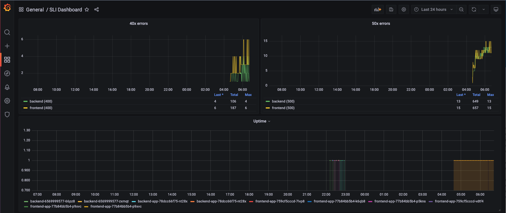

## Verify the monitoring installation

Run `kubectl` command to show the running pods and services for all components. Take a screenshot of the output and include it here to verify the installation

## Setup the Jaeger and Prometheus source

Expose Grafana to the internet and then setup Prometheus as a data source. Provide a screenshot of the home page after logging into Grafana.

## Create a Basic Dashboard

Create a dashboard in Grafana that shows Prometheus as a source. Take a screenshot and include it here.

## Describe SLO/SLI

Describe, in your own words, what the SLIs are, based on an SLO of *monthly uptime* and *request response time*.

A **Service-Level Indicator (SLI)** is a *specific/actual metric* used to measure the performance of a service, while the **Service-Level Objective (SLO)** is a measurable goal set by the team to ensure a standard level of performance during a specified period of time.

> The application had an uptime of 97.2% last month, and the average time taken to return a request during the month of April was 123 ms.

## Creating SLI metrics.

It is important to know why we want to measure certain metrics for our customer. Describe in detail 5 metrics to measure these SLIs. 

- **Site Latency/System Thoroughput** measures the time it takes for some data to get to its destination across the network. It is usually measured as a round trip delay - the time taken for information to get to its destination and back again. The round trip delay is an important measure because a computer that uses a TCP/IP network sends a limited amount of data to its destination and then waits for an acknowledgement to come back before sending any more.  Thus, the round trip delay has a key impact on the performance of the network. Latency drives the responsiveness of the network - how fast each conversation can be had. For TCP/IP networks, latency also drives the maximum throughput of a conversation.
- **Network Uptime/Availability** refers to the time when a network is up and running. A network’s uptime is typically measured by calculating the ratio of uptime to downtime within a year, then expressing that ratio as a percentage. The concept of “five-nines” — a network availability of *99.999%* — has been an industry gold standard for many years, and this translates to about *5.26 minutes* of unplanned downtime a year.
- **Response Rate** is the average time taken for successful requests of a service during a particular period. For example, your service will respond within one second for 99% of all requests.
- **Error Rate** is the percentage of acceptable errors within a given period. For example, a 1% error rate would result in an SLO at 99%, indicating that the customer is having a relatively error-free positive experience.
- The **Bandwidth** of a network refers to its capacity to carry traffic. A higher bandwidth means that more traffic can be carried. It does not imply how fast that communication will take place (although if you attempt to put more traffic over a network than the available bandwidth, you'll get packets of data being discarded and re-transmitted later, which will degrade your performance). Bandwidth limits the number of those conversations that can be supported.

## Create a Dashboard to measure our SLIs

Create a dashboard to measure the uptime of the frontend and backend services We will also want to measure to measure 40x and 50x errors. Create a dashboard that show these values over a 24 hour period and take a screenshot.

## Tracing our Flask App

We will create a Jaeger span to measure the processes on the backend. Once you fill in the span, provide a screenshot of it here. Also provide a (screenshot) sample Python file containing a trace and span code used to perform Jaeger traces on the backend service.

## Jaeger in Dashboards

Now that the trace is running, let's add the metric to our current Grafana dashboard. Once this is completed, provide a screenshot of it here.

## Report Error

Below is a trouble ticket for the developers, to explain the errors that you are seeing (400, 500, latency) and to let them know the file that is causing the issue also include a screenshot of the tracer span to demonstrate how we can user a tracer to locate errors easily.

TROUBLE TICKET

Name: Error in `trial/app/app.py`

Date: January 23, 2022 08:05:44

Subject: Cannot retrieve the number of jobs from provided URL

Affected Area: `"./reference-app/trial/app/app.py", line 62, in trial-app`

Severity: High

Description: `JSONDecodeError`: There's an issue around the way the request-response data is structured, cannot evaluate the length of the JSON output. It seems to be a problem with the jobs endpoint.

## Creating SLIs and SLOs

We want to create an SLO guaranteeing that our application has a 99.95% uptime per month. Name four SLIs that you would use to measure the success of this SLO.

**SLO:**

- 99.95% uptime per month

**SLIs:**

1. The application had an uptime of 99.98% last month
2. 99% of the homepage requests in the previous month were served in < 200ms
3. The average of 2xx/3xx responses from the web application in the previous month is 98.3%
4. The application error rate last month is 0.03% (i.e. 100% - 99.95%)

## Building KPIs for our plan

Now that we have our SLIs and SLOs, create a list of 2-3 KPIs to accurately measure these metrics as well as a description of why those KPIs were chosen. We will make a dashboard for this, but first write them down here.

1. Measure the availability of the systems/services to ensure they can respond to user requests successfully. The backend and frontend services can be measured. If your system is not responding to requests successfully, it's safe to assume it is not meeting your users' expec- tations of its reliability.
2. Track the average of 2xx or 3xx reponses of the web application as a ratio of the overall number of requests. A commonly used signifier of success or failure is the status code of an HTTP response.
3. Measure the average time it takes to prcoess a request. A system is not perceived as "responsive" by its users if their requests are not responded to in a timely fashion.

## Final Dashboard

Create a Dashboard containing graphs that capture all the metrics of your KPIs and adequately representing your SLIs and SLOs. Include a screenshot of the dashboard here, and write a text description of what graphs are represented in the dashboard.  

**Description of graphs**

- **Uptime**: The percentage of time the backend and frontend services are fully operational
- **Memory Usage**: The memory usage of the backend and frontend services.
- **CPU Usage**: The CPU usage of the backend and frontend services as measured over 30 seconds intervals.
- **40x errors**: Number of 40x errors across the backend and frontend services. This is used to mmeasure Error SLI
- **50x errors**: Number of 50x errors across the backend and frontend services. This is used to mmeasure Error SLI
- **Average response time [30s]**: The average response time across the backend and frontend services measured over 30 seconds intervals for successful requests.
- **Requests per second**: Number of successful requests per second across the backend and frontend services.
- **Errors per second**: Number of failed (non HTTP 200) responses per second across the backend and frontend services categorized by error code.
- **Total requests per minute**: The total number of requests measured over one minute intervals in the backend and frontend pods.